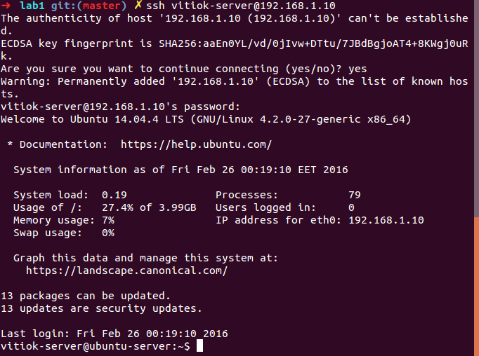

## Setting up virtual machine 
- In order to connect to remote server we have to make one. For this purpose we can use virtual box. So first step is to download virtual box on our machine. Here is the [link](https://www.virtualbox.org/wiki/Downloads) to the official site. 

- After installing Virtual Box we have to download one of the linux distributors. I've chosen [this](http://www.ubuntu.com/download/server/thank-you?country=MD&version=14.04.4&architecture=amd64) one, because it's more light weighted. 

- Install ubuntu server and run the machine. It's important to change network adapter, set the amount of memory and path to iso file from which to boot the machine. So this is how it looks:

. Now we can see our shell:



- Now we can perform any command from our terminal!

## Run some simple programs
- By default ubuntu has python install so we can run any python script. However in order to run any others we have install the necessary compilers. So type in the following commands to install gcc, g++:  

	```sudo apt-get install gcc```    
	```sudo apt-get install g++```

In order to install ruby we have to run a little bit more commands. I prefered to install it with rvm, but there are a lot of other ways:   

	sudo apt-get update
	sudo apt-get install build-essential make curl   
	\curl -L https://get.rvm.io | bash -s stable 
	source ~/.bash_profile   
	rvm install ruby-2.1.4

I'm a JS developer that's why I'll also install node.js:

	curl -sL https://deb.nodesource.com/setup_5.x | sudo -E bash -
	sudo apt-get install -y nodejs

- The environment is set and we are ready to go. We have to create our hello world programs:

	```touch main.c```  
	```touch main.cpp```  
	```touch index.js```  
	```touch index.rb``` 

- It's time to fill in files. We can do it using one of the CLI editors or we can do it with ```echo``` command. For example for ruby file:

	```echo "puts 'Hello World!'" >> index.rb```  

- Run programs with the following commands:

	 ```
	 gcc main.c -o main  
	 ./main  

	 g++ main.cpp -o maincpp
	 ./maincpp

	 ruby index.rb

	 node index.js
	 ```  

## Set up git

- First of all we have to install git `sudo apt-get install git`
- Configure global user	name `git config --global user.name "vitiok"`
- Configure global user	email `git config --global user.email "lucavictor220@gmail.com"`
- Initialize git repo `git init`
- Generate ssh key with `ssh-keygen`
- Set the public key in github

## Add files to remote server

- Clone the repo with `git clone`
- Move created files in the repo `mv -t directoryPath file1 file2 file3`
- Check the status `git status`
- Add changes `git add --all`
- Commit changes `git commit -m "comments"`
- Push to remote server `git push origin master`
- Now we can see our changes on the github.    

## Another way to start with your project

- Initialize local repo `git init`
- Create file and commit it
- Create a repo on github and add remote server `git remote add origin http://githuburl..`
- Pull from remote repo to local `git pull origin master`
- Now can work further on this project

## Create new branches 

- Add two new branches with `git branch nameOfBranch`
- Move to new branch with `git checkout nameOfBranch`
- Now we can commit to a new branch
- If we want to move back or to another branch use again `git checkout anotherBranchName`
- This is how it looks in command line:


## Tracking, reset and merging

- To set a branch to track a remote server we can do the following `git push -u origin newLayout`


- To reset branch to previous commit use `git checkout c91796325d3e02816b96e72c63ed584e9bbb741f`


- If we need to get rid of all we did until a certain commit `git reset --hard c91796325d3e02816b96e72c63ed584e9bbb741f`
- Merging of two branches is done with `git merge nameOfBranchToMergeCurrentOne`


- In some situations auto-merge is not possible this is the case we have to solve conflicts.


For example we can have something like this in the file:

  
In this case we have to decide which changes are right and then commit them. Git shows the contents of both branches in the file so solving conflicts is really easy in most of the cases.

##Conclusion

In any project the most important part is to deliver it to the users. A common approach to this problem is simply set up a remote server and to customize the environment on it to run our project. This is the thing we've done at this laboratory work for some simple programs as "helloworld" are. Imagine if we would have a slightly more difficult project. For example a rails project with a lot of stuff which is needed to be set up. In this case setting that environment manually as we've done at this laboratory work would take a lot of time. This is the point where such tools as vagrant or docker comes in handy. They allow you to set your environment in more easy way. It could even be as simple as choosing the right box for your project and everything will be set for us.

VCS is a wonderful tool which allow you to control your project, work with a team of developers and to track all the changes which was ever made. We've set a good background on VCS and Git in particular.

There are still a lot of things to discover on this topic. I'll definitely come back to this topic again!
