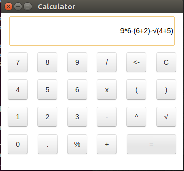
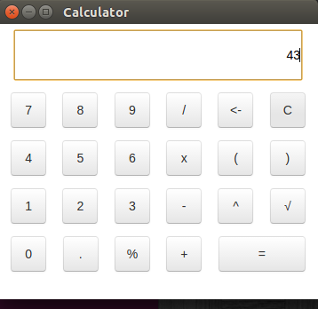

# Calculator

I decided to make my calculator in [electron](http://electron.atom.io/). Electron enables you to create desktop applications with pure JavaScript by providing a runtime with rich native (operating system) APIs. You could see it as a variant of the Node.js runtime that is focused on desktop applications instead of web servers.

## Frontend

 In electron we have two processes: main and rendering one. Frontend of the application refers to rendering process and it is basically a simple html page. I used [bootstrap](http://getbootstrap.com/css/) for style and a bit of js to handle buttons click.

## Backend

 Application is staring from the main process and which is specified in my case in index.js file. In order to communicate between main and redering process we use [ipcMain](http://electron.atom.io/docs/v0.37.4/api/ipc-main/) and ipcRender.
 The main challange was how to parse the string from input and compute the result. For this purpose I used two algorithms which basically made the core of the app: [Shunting Yard Algorithm](https://en.wikipedia.org/wiki/Shunting-yard_algorithm) - which transforms expression in RPN(Reverse Polish Notation) and then RPN Calculator - which computes the RPN expression.

## How it works
So here it is...

Enter values and press enter...

## Conclusion

This laboratory work was of great experience for me. My first impression was that calculator is an easy thing to do, but it turns out that is not. The difficult part which still should be improved is validation of the input. There are tons of special cases which should be taken in account. Overall the purpose was achieved. Calculator is working properly and it UI is running in a different process than the core. A good thing is that my calculator might be easily extended by adding new opperation without having trouble with change a lot of code. Electron is a great tool for building desktop apps for those who come from a web development environment.

