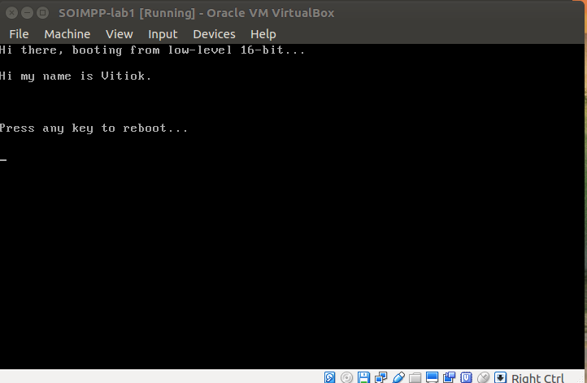

# Laboratory work 1

## Simple boot loader in assembly language

### Pre Requirements

- Text Editor (Ex: Sublime, notepad++...)
- NASM (http://www.nasm.us/)
- Virtual Box (https://www.virtualbox.org/)

### Work flow

Since I'm using a linux destribution Ubuntu I used the following command to install NASM `sudo apt-get install nasm`

In order to create image from boot.asm file I've used `nasm -f bin boot.asm -o boot.img` command.
When the file was ready to use I created a VM in my Virtual Box and added it as Floppy Controller. At that point everything was set up and I was ready to boot my machine.

### Screenshot

### Conclusion

It was an interesting task to perform. I've learn how to make a simple boot loader in assembly language and how to set my VM to use it in order to boot.
